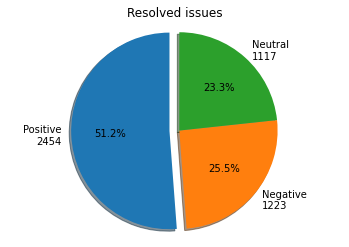

# sentiment-analyzer
Github comments sentiment anlysis via NLTK(www.text-processing.com) and GitHub API

The code also could be found on  https://colab.research.google.com/drive/1oa9_joAGwFQacIe9OJoBcgG1QiGTipA6?usp=sharing

## Proccess

1. We extract the github comments from https://github.com/ubuntu/microk8s repository
2. We process the comments using NLTK tool since they have open API that is comfortable to use
 
 NLTK returns the probablity of the comment being positive, negative or neutral
 
4. We analyze the results

## Results

We analyzed ~15k comments

Please check the summary below:

