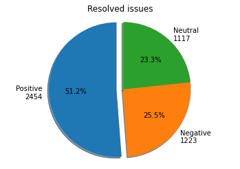
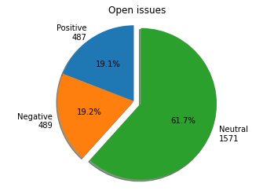
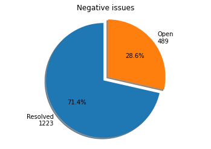
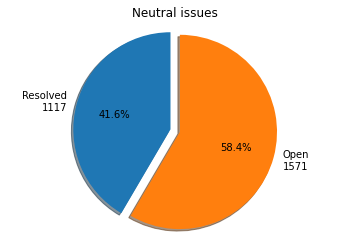
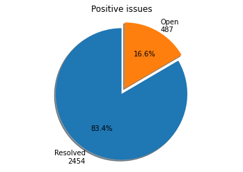
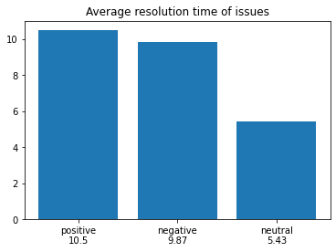
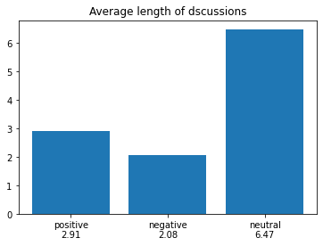

# sentiment analyzer
Github comments sentiment anlysis via NLTK(www.text-processing.com) and GitHub API

The code also could be found on  
* https://colab.research.google.com/drive/1oa9_joAGwFQacIe9OJoBcgG1QiGTipA6?usp=sharing
* https://colab.research.google.com/drive/1qKjb9wMairmYAKYWHeWPnYiIFOn0hglB?usp=sharing
* https://drive.google.com/file/d/1Farif7X2IcfS5L3f6vOTu7dOGi0YEapH/view

## Proccess

1. We extract the github comments from repository via Github API.
2. We prerocess the comments using NLTK toolkit since they have open API that is comfortable to use.
3. NLTK returns the probablity of the comment being positive, negative or neutral. The label is assigned for the further model precision measurement.
4. We train and tune our model on the 70% of the comments dataset and test it against the remaining 30%.
5. We gather the sentiment metrics from the dataset with issue-structured comments and analyze the results.

## Results

We analyzed ~15k comments. The summary is presented below.

### Resolved vs Open issues

### Fraction of resoled issues within each sentiment

## Time and length of discussion per sentiment

